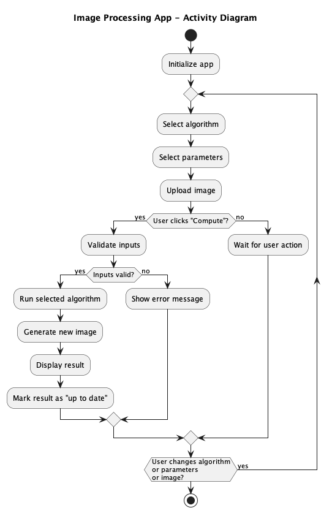

# Image manipulation APP

This `streamlit` app allows you to manipulate an image using the function written in the numpy exercise.

these functions are:
- extract_red
  - **signature**: def extract_red(image: np.ndarray)
  - **description**: Extract the red channel from an image.
- extract_green
  - **signature**: def extract_green(image: np.ndarray)
  - **description**: Extract the green channel from an image. 
- extract_blue
  - **signature**: def extract_blue(image: np.ndarray)
  - **description**: Extract the blue channel from an image. 
- grayscale
  - **signature**: def grayscale(image: np.ndarray)
  - **description**: Convert the image to grayscale.
- negative
  - **signature**: def negative(image: np.ndarray)
  - **description**: Convert the image to its negative value.
- color_reduced
  - **signature**: def color_reduced(image: np.ndarray, threshold: int)
  - **description**: Convert the image to a color reduced image (check the function already written in the numpy exercise /!\\ the threshold this time is given in parameter)
- photomaton
  - **signature**: def photomaton(image: np.ndarray)
  - **description**: Convert the image to a photomaton 

## Streamlit interface

You should use the skeleton provided in the `app.py` file. Thia skeletin already contsains some logic. You need to add the missing code `...`.

- line 46: add the [selectbox](https://docs.streamlit.io/develop/api-reference/widgets/st.selectbox) for the image manipulation functions. 
  - The `selectbox` should have the following parameters:
    - label: "Select the image manipulation function"
    - options: the list of available options as list of strings
    - index: 3, index is the default value selected, the index is the index of the option in the list, by default `grayscale`
- line 46: add the selectbox for the threshold if the function color_reduced is selected
  - The `selectbox` should have the following parameters:
    - label: "Threshold"
    - options: the list of available options as list of integers where each integer is a power of 2 from 2 to 128
    - index: 1, index is the default value selected, the index is the index of the option in the list, by default 128 
- line 51: add the [file_uploader](https://docs.streamlit.io/develop/api-reference/widgets/st.file_uploader) for the image
  - The `file_uploader` should have the following parameters:
    - label: "Upload any `jpeg` image with a shape of (225, 400, 3)"
    - type: a list of string containng only jpeg possibilities

The interface has already a [button](https://docs.streamlit.io/develop/api-reference/widgets/st.button) named "Compute" that you should use to trigger the logic, this button is already connect to the rest of the logic. 

## Flow of the APP

